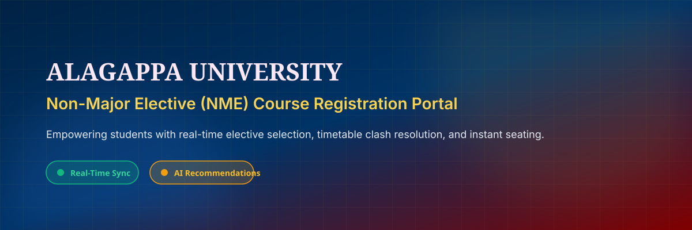
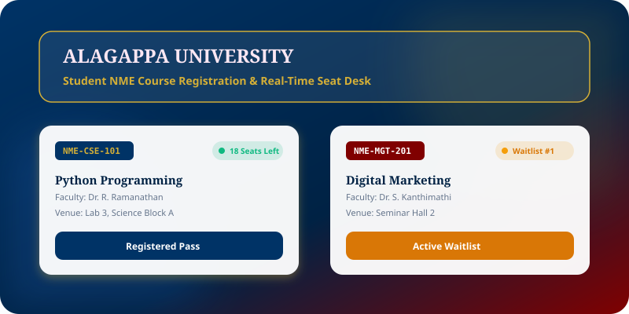
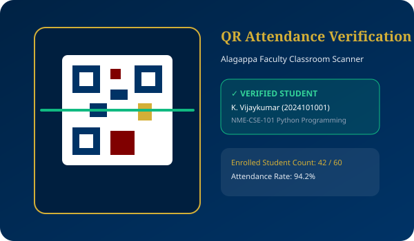
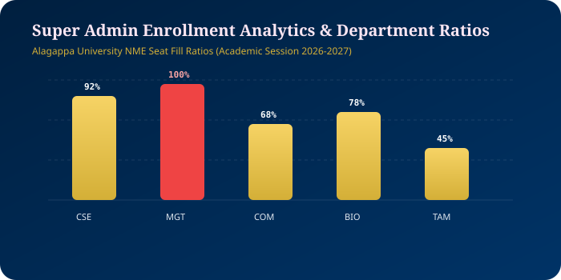

# 🏛️ Alagappa University Real-Time NME Course Registration System

[](https://nme.alagappa.ac.in)
[](https://vijaymahes9080.github.io/Alagappa_NME/)
[](file:///d:/intership/Alagappa_NME/docs)
[](file:///d:/intership/Alagappa_NME/LICENSE)
[](mailto:Vijaypradhap2004@gmail.com)

An enterprise-grade, real-time Non-Major Elective (NME) Course Registration Portal engineered for **Alagappa University, Karaikudi**. Designed to digitize elective course selection, eliminate timetable conflicts, provide sub-second live seat tracking, auto-manage waiting lists, and support bilingual access (**English & Tamil தமிழ்**).

---

## 📸 Interactive System Visual Carousel & Vector Gallery

````carousel

<!-- slide -->

<!-- slide -->

<!-- slide -->

<!-- slide -->

<!-- slide -->

````

---

## 🖼️ Multi-Image Feature Matrix

| 🎓 Student Course Discovery & Seat Counter | 👨‍🏫 Faculty QR Attendance Scanner |
| :---: | :---: |
|  |  |
| **Real-time seat count with live Green/Amber/Red indicators** | **Instant camera QR scanner for student verification** |

<br/>

| ⚡ Super Admin Department Ratios | 🤖 AI Course Advisor Bot |
| :---: | :---: |
|  |  |
| **Department fill velocity & audit activity tracking** | **Personalized recommendations based on CGPA & schedule** |

<br/>

<p align="center">
  
  <br/>
  <b>Official Alagappa University NME Digital Seal &amp; Badge</b>
</p>

---

## 🎨 Official Alagappa University Theme & Branding

| Primary Brand Color | Hex Code | Role |
| :--- | :--- | :--- |
| **Royal Academic Blue** | `#003366` | Header backgrounds, primary buttons & navigation branding |
| **Deep University Navy** | `#002244` | Dark mode container fill & footer backgrounds |
| **Crimson Maroon** | `#800000` | Accent stripes, warning badges & department highlights |
| **Warm Gold** | `#D4AF37` | Text highlights, active tabs, seals & icons |

*The official vector logo asset is located at [`assets/alagappa_logo.svg`](assets/alagappa_logo.svg).*

---

## ⚡ Key System Features & Enterprise Innovations

- **🔴🟡🟢 Real-Time Seat Counter**: Live Socket.io seat synchronization with color indicators (Green > 20% available, Amber ≤ 20% left, Red = FULL / Waitlist).
- **🗣️ AI Voice Search Controller**: Web Speech API voice search supporting queries in English and Tamil.
- **📷 QR Code Classroom Attendance Scanner**: Camera scanner for Faculty to verify student registration slips and mark attendance.
- **📅 Timetable Conflict Checker Matrix**: Visual schedule grid preventing day/time course overlaps.
- **💳 Credit Points & Fee Waiver Ledger**: Tracks Govt. of Tamil Nadu tuition fee waivers and CGPA honors qualification.
- **📜 Verified Completion Certificate Generator**: Instant PDF certificate renderer signed by Alagappa University NME Cell.
- **📊 Department Analytics Matrix**: Fill velocity charts and CSV export matrix for university administrators.
- **🤖 AI Course Advisor**: Embedded floating AI chatbot for course recommendations.
- **📱 PWA & Offline Engine**: Full Service Worker caching and PWA installation manifest.
- **🎓 Role-Based Dashboards**: Super Admin, Department Admin, Faculty, and Student portals.

---

## 📁 Repository Directory Structure

```
Alagappa_NME/
├── frontend/             # Vite + React 19 + Redux Toolkit + Socket.io-client + Tailwind/MUI
├── backend/              # Node.js + Express.js + Socket.io Server + Prisma ORM + JWT Auth
├── database/             # Prisma Schema (schema.prisma) & SQLite/PostgreSQL setup
├── database-schema/      # Standalone SQL schema definitions (schema.sql)
├── docs/                 # 13 SRS & Technical Specifications (Architecture, DFD, ERD, Security)
├── assets/               # SVG Branding (alagappa_logo.svg, nme_banner.svg, student_dashboard_hero.svg...)
├── wireframes/           # Text & SVG UI/UX Wireframes (UI_Wireframes.md)
├── postman/              # Ready-to-import Postman API Collection (NME_API_Collection.json)
├── swagger/              # OpenAPI 3.0 API Specification (openapi.json)
├── testing/              # API Integration and Unit Tests (api_tests.spec.js)
├── deployment/           # Production Nginx Server Configuration (deploy_nginx.conf)
├── reports/              # Sample JSON/PDF Export Templates (Sample_Analytics_Report.json)
├── security/             # Security Policies & OWASP Compliance Checklist (Security_Policy.md)
├── diagrams/             # Mermaid Architecture & Registration Sequence Flowcharts
├── prompts/              # AI Engine prompts & documentation rules (system_prompts.md)
├── start_all.bat         # One-click Windows batch launcher for both servers
├── run.bat               # Shortcut batch launcher
├── LICENSE               # Official MIT Open-Source License
├── .gitignore            # Git exclusion rules
├── composer.json         # Project metadata & author details
├── comment.md            # Complete prompt, feedback, and execution log
└── README.md             # Master project documentation
```

---

## 🚀 Quick Start Guide (One-Click Launcher)

### Option 1: Double-Click `.bat` Launcher (Windows)
Double-click [`start_all.bat`](start_all.bat) or [`run.bat`](run.bat) in the project root folder.
This will automatically launch separate terminal windows for both backend and frontend:
- **Backend API & Socket Server**: `http://localhost:5000`
- **Frontend React Portal**: `http://localhost:3000`

---

### Option 2: Manual Terminal Commands

#### 1. Start Backend API & Socket Server
```bash
cd backend
npm run dev
```

#### 2. Start Frontend React Web Application
```bash
cd frontend
npm run dev
```

---

## 🔐 Demo User Credentials & Role Security

| Role | Username / Email | Required Password | Accessible Dashboard |
| :--- | :--- | :--- | :--- |
| **Super Admin** | `admin@alagappa.ac.in` | `SuperAdmin@2026` | `/admin/dashboard` |
| **Department Admin** | `cs_admin@alagappa.ac.in` | `DeptAdmin@2026` | `/department/dashboard` |
| **Faculty Instructor** | `ramanathan@alagappa.ac.in` | `Faculty@2026` | `/faculty/dashboard` |
| **Student** | `student@alagappa.ac.in` | `Student@2026` | `/student/dashboard` |

---

## 📜 License & Copyright

Distributed under the [MIT License](LICENSE).
Copyright © 2026 Vijay Mahes / Alagappa University, Karaikudi. All rights reserved.
